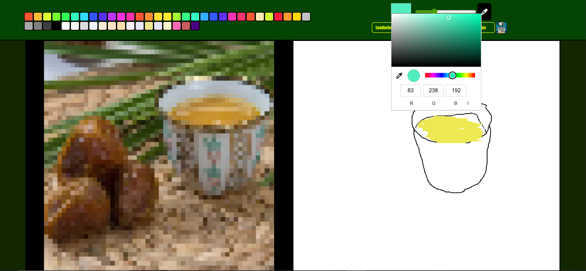
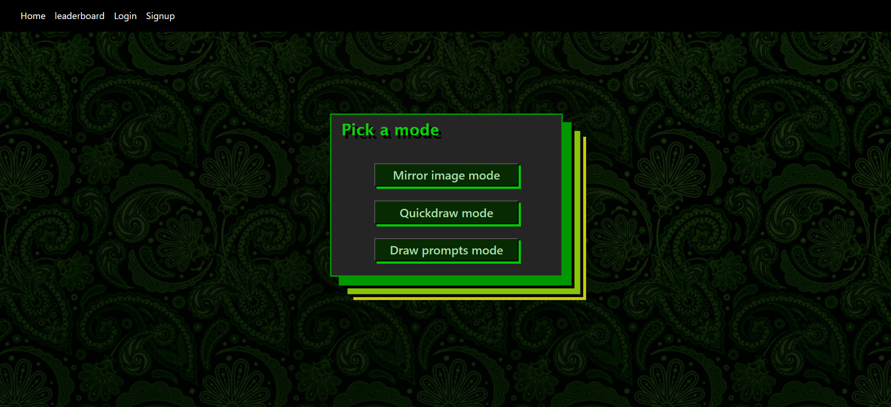
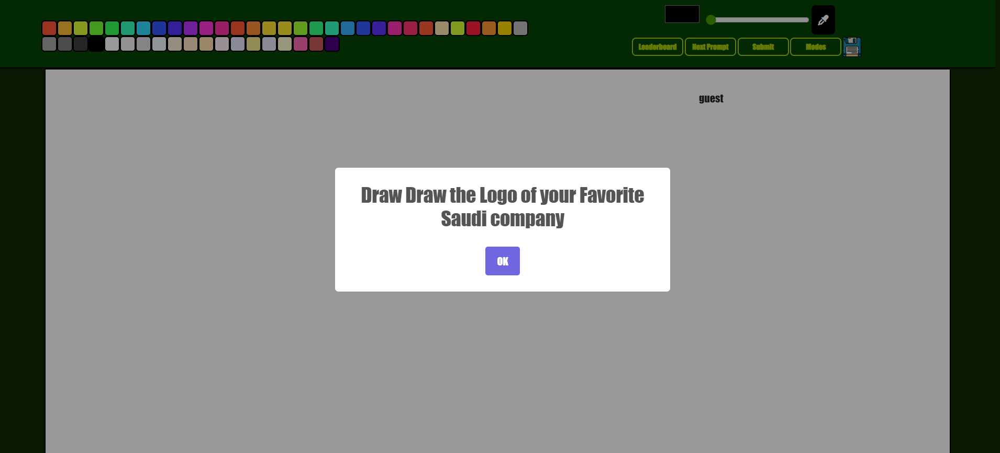
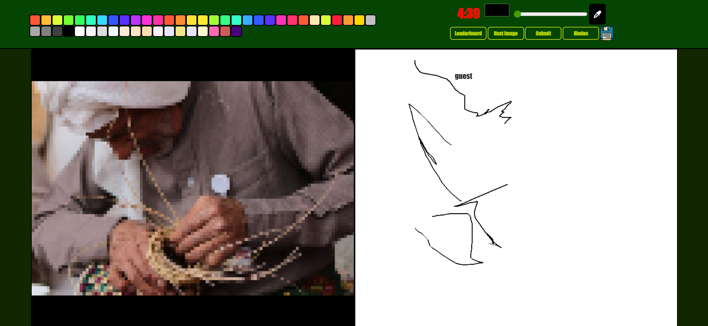
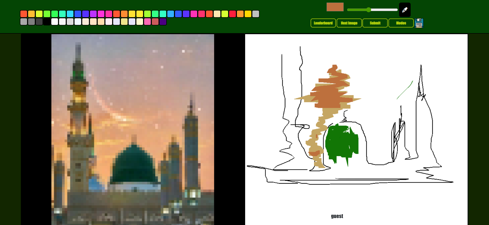
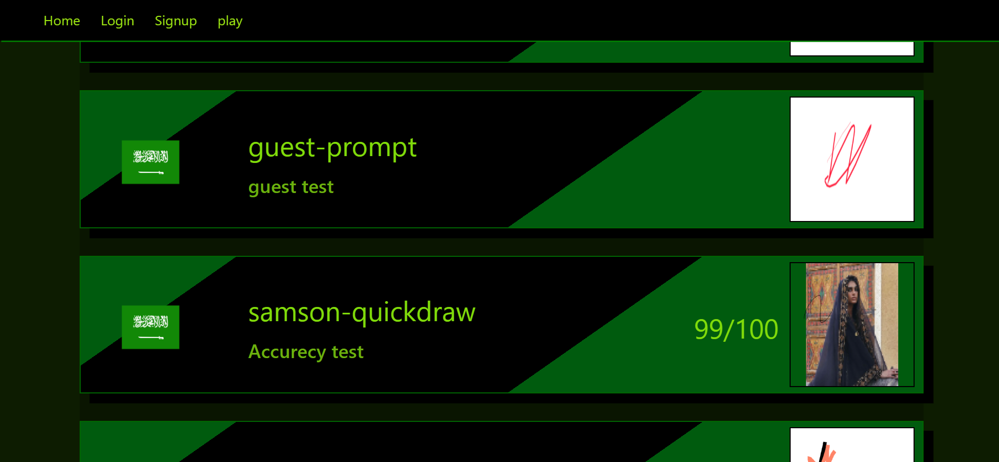

# National Day Painting Game

Pure JavaScript application created to celebrate Saudi Arabia's National Day.

# Overview

It's a picture-matching game with a twist: you have to draw the image you see as accurately as you can.There are multiple modes available.

## Modes

You can pick the mode you’d like to compete in.

### Prompt Mode

In this mode, you're encouraged to draw the first thing that comes to mind based on a prompt, and then share your creation with others when you're done.

### Quickdraw

Draw the image as best as you can while racing against the clock to try to finish quickly and keep your score as high as possible.

### Mirror Image

Take your time to replicate the picture as accurately as you can. You can share your drawing once you're finished.

# Leaderboard

After sharing your work, check out the leaderboard to see scores along with other players' art.

